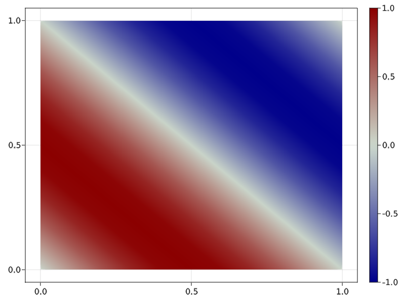
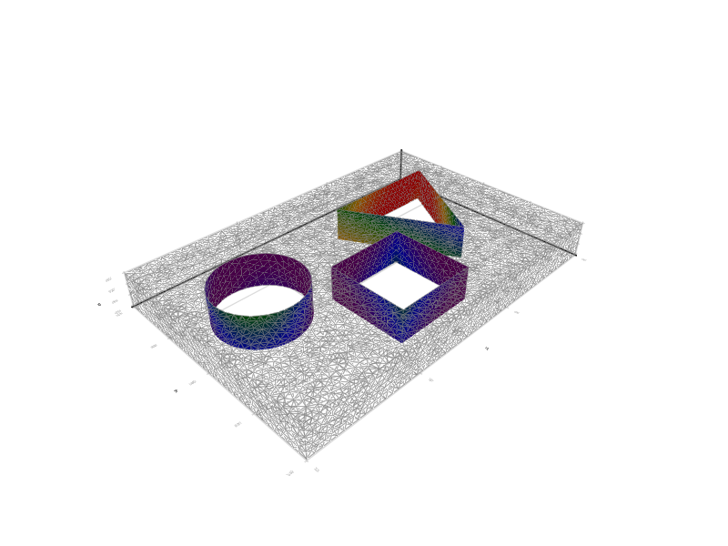

# GridapMakie

[](https://gridap.github.io/GridapMakie.jl/stable)
[](https://gridap.github.io/GridapMakie.jl/dev)
[](https://github.com/gridap/GridapMakie.jl/actions)
[](https://codecov.io/gh/gridap/GridapMakie.jl)

## Overview

The visualization of numerical results is an important part of FE computations. However, before the inception of GridapMakie.jl, the
only approach available to data visualization of [Gridap.jl](https://github.com/gridap/Gridap.jl) computations was to write simulation
data to data files (e.g., in vtu format) for later visualization with, e.g., Paraview or VisIt. From the idea of visually inspecting
data from Julia code directly or to manipulate it with packages of the Julia
open-source package ecosystem, [GridapMakie.jl](https://github.com/gridap/GridapMakie.jl) is born. As a part of the Google Summer of
Code 2021 program, GridapMakie adopts [Makie.jl](https://github.com/JuliaPlots/Makie.jl) as a second visualization back-end for
Gridap.jl simulations. This package is thought as a built-in tool to assess the user in their FE calculations with a smoother workflow
in a highly intuitive API.

## Installation

According to Makie's guidelines, it is enough to install one of its backends, e.g. GLMakie. Additionally, Gridap provides the plot objects
to be visualized

```julia
julia> ]
pkg> add Gridap, GridapMakie, GLMakie
```

## Examples

First things first, we shall be using the three packages as well as FileIO to save results.
We may as well create directories to store downloaded meshes and output files

````julia
using Gridap, GridapMakie, GLMakie
using FileIO
mkdir("models")
mkdir("images")
````

### 2D Plots

Then, let us consider a simple, 2D simplexified cartesian triangulation Ω

````julia
domain = (0, 1, 0, 1)
cell_nums = (10, 10)
model = CartesianDiscreteModel(domain, cell_nums) |> simplexify
Ω = Triangulation(model)
````

The visualization of the vertices and edges of Ω can be achieved as follows

````julia
fig = plot(Ω)
wireframe!(Ω, color=:black, linewidth=2)
scatter!(Ω, marker=:star8, markersize=20, color=:blue)
save("images/2d_Fig1.png", fig)
````


We now consider the nodal field uh

````julia
reffe = ReferenceFE(lagrangian, Float64, 1)
V = FESpace(model, reffe)
uh = interpolate(x->sin(π*(x[1]+x[2])), V)
````

and plot it over Ω, adding a colorbar

````julia
fig, _ , plt = plot(Ω, uh)
Colorbar(fig[1,2], plt)
save("images/2d_Fig11.png", fig)
````



On the other hand, we may as well plot a cell field

````julia
celldata = π*rand(num_cells(Ω)) .-1
fig, _ , plt = plot(Ω, color=celldata, colormap=:heat)
Colorbar(fig[2,1], plt, vertical=false)
save("images/2d_Fig13.png", fig)
````


If we are only interested in the boundary of Ω, namely Γ

````julia
Γ = BoundaryTriangulation(model)
fig, _ , plt = plot(Γ, uh, colormap=:algae, linewidth=10)
Colorbar(fig[1,2], plt)
save("images/2d_Fig111.png", fig)
````


### 3D Plots

In addition to the 2D plots, GridapMakie is able to handle more complex geometries. For example,
take the mesh from the [first Gridap tutorial](https://gridap.github.io/Tutorials/stable/pages/t001_poisson/#Tutorial-1:-Poisson-equation-1),
which can be downloaded using

````julia
url = "https://github.com/gridap/GridapMakie.jl/raw/d5d74190e68bd310483fead8a4154235a61815c5/_readme/model.json"
download(url,"models/model.json")
````

Therefore, we may as well visualize such mesh

````julia
model = DiscreteModelFromFile("models/model.json")
Ω = Triangulation(model)
∂Ω = BoundaryTriangulation(model)
fig = plot(Ω, shading=true)
wireframe!(∂Ω, color=:black)
save("images/3d_Fig1.png", fig)
````


````julia
v(x) = sin(π*(x[1]+x[2]+x[3]))
fig, ax, plt = plot(Ω, v, shading=true)
Colorbar(fig[1,2], plt)
save("images/3d_Fig3.png", fig)
````



we can even plot FE approximations in certain subdomains, e.g.

````julia
Γ = BoundaryTriangulation(model, tags=["square", "triangle", "circle"])
fig = plot(Γ, v, colormap=:rainbow, shading=true)
wireframe!(∂Ω, linewidth=0.5, color=:gray)
save("images/3d_Fig2.png", fig)
````


### Animations and interactivity

Finally, by using Makie [Observables](https://makie.juliaplots.org/stable/interaction/nodes.html), we
can create animations or interactive plots. For example, if the nodal field has a time dependence

````julia
t = Observable(0.0)
u = lift(t) do t
    x->sin(π*(x[1]+x[2]+x[3]))*cos(π*t)
end
fig = plot(Ω, u, colormap=:rainbow, shading=true, colorrange=(-1,1))
wireframe!(∂Ω, color=:black, linewidth=0.5)
framerate = 30
timestamps = range(0, 2, step=1/framerate)
record(fig, "images/animation.gif", timestamps; framerate=framerate) do this_t
    t[] = this_t
end
````


---

*This page was generated using [Literate.jl](https://github.com/fredrikekre/Literate.jl).*

